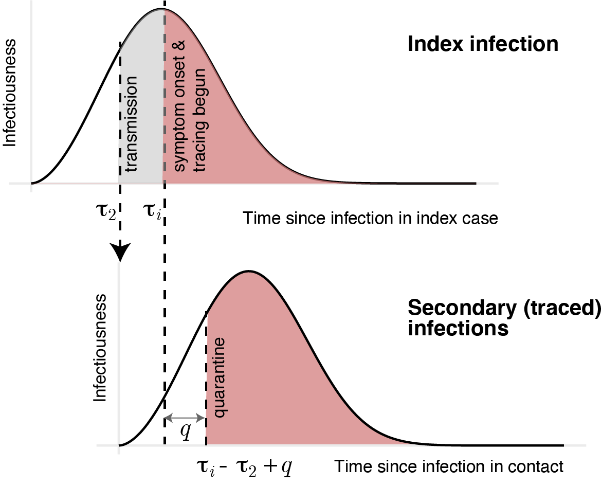

```{r setup, include=FALSE}
knitr::opts_chunk$set(echo = TRUE)
library(ggplot2)
library(tidyverse)
library(directlabels)
library(gridExtra)
library(scales)

recalc<-FALSE

```

## Abstract

_Background_

The World Health Organization has called for increased molecular testing in response to the COVID-19 pandemic, but different countries have taken very different approaches and the effectiveness of different testing strategies is unknown.

_Methods_

We developed a mathematical model of SARS-CoV-2 transmission based on known patterns of infectiousness and PCR test sensitivity over time since infection. We estimated the reduction in the reproduction number (R) achieved by testing and isolating symptomatic individuals, regular screening of high-risk groups irrespective of symptoms, and quarantine of contacts identified through ‘test-and-trace’ protocols. We reviewed data on the performance of antibody tests and the potential of ‘immunity passports’.

_Results_

Weekly screening of healthcare workers and other high-risk groups irrespective of symptoms using PCR is estimated to reduce their contribution to transmission by ~20-30%, on top of reductions achieved by self-isolation following symptoms. The effectiveness of test-and-trace depends strongly on coverage and the timeliness of contact tracing, potentially reducing R by ~25% if 80% of cases and contacts are identified and there is immediate testing on symptom onset and quarantine of contacts within 24 hours. Immunity passports based on tests for antibody or infection could support return to work but face significant technical, legal and ethical challenges.

_Interpretation_

PCR and antibody testing can play a critical role in prevention of SARS-CoV-2 transmission, especially among healthcare workers and other high-risk groups, but no single strategy will reduce R below 1 at current levels of population immunity.

_Funding_

Medical Research Council.

## Research in context

_Evidence before this study_

Evidence on the performance of SARS-CoV-2 tests and our understanding of COVID-19 epidemiology has been evolving rapidly, with much of the scientific evidence still only available as preprints rather than peer-reviewed publications. We therefore searched PubMed and the MedRXiv preprint server (using the R package medrxivr) using the search term "(SARS or COVID or coronavirus) and test* and model and math*" on 1st June 2020 for papers published or uploaded in 2020. The search returned 20 publications and 43 preprints, from which we identified 11 studies that used mathematical modelling to evaluate the role of testing in COVID-19 control, including 2 preprints missed by the search but known to the authors. Two studies examined regular screening of healthcare workers for infection, one considered the effectiveness of ‘test-and-trace’ strategies (assuming 100% test sensitivity), 3 studies examined universal mass testing (irrespective of symptoms) and 6 modelled increased testing simply as an increase in the rate at which infections were detected and isolated. Model results were often divergent, reflecting different assumptions about SARS-CoV-2 epidemiology and testing capacity. Weekly screening of healthcare workers was estimated to prevent between 5% and 24% of transmission from this group, test-and-trace reduced the reproduction number (R) between 15% and 50% depending on coverage and timeliness of test results, and universal mass testing between a 2% reduction in R to a substantial 40% reduction in the epidemic size depending on coverage and frequency. Very few of these studies considered test performance (sensitivity, specificity) and only one study considered more than one of these testing strategies.

_Added value of this study_

Our study specifically evaluates the optimal use of available SARS-CoV-2 nucleic acid and antibody tests for the prevention of transmission. We developed a mathematical framework describing infectiousness and test sensitivity over time since infection to estimate the effectiveness of alternative strategies, including regular screening of high-risk groups such as health and social care workers and the effectiveness and efficiency of test-and-trace. We integrated current evidence on the sensitivity and specificity of available tests alongside epidemiological data on the proportion of asymptomatic infections and the contribution of asymptomatic and presymptomatic infections to transmission. We performed sensitivity analyses to determine the robustness of our results and consider the implications of our findings for national testing policies.

_Implications of all the available evidence_

Testing can play a critical role in the prevention of SARS-CoV-2 transmission, in addition to its established use for pandemic surveillance and infection control in hospitals. Optimal strategies should include regular screening of high-risk groups such as health and social care workers during periods of sustained transmission, and testing of people with COVID-19 symptoms and tracing and quarantining their contacts. Test-and-trace requires high coverage (proportion of cases tested and contacts successfully traced and quarantined) and rapid testing and contact tracing to be effective. Testing alone is unlikely to bring the reproduction number for SARS-CoV-2 transmission below 1 at current levels of immunity and will need to be complemented by other interventions such as social distancing.


## Background

Different countries have taken very different approaches to molecular testing in response to the COVID-19 pandemic. The observation that countries with high rates of testing for SARS-CoV-2 have more-effectively controlled transmission (e.g. South Korea, Germany) has led to calls for increased testing in other countries with lower rates of testing (e.g. UK, USA). However, the contribution of testing to COVID-19 control compared with other interventions such as self-isolation and social distancing is currently unclear. 

There is a clear priority to test suspected COVID-19 patients in hospital to inform treatment, infection control and to monitor the extent of the epidemic. As testing capacity increases it is important to determine the role of wider testing in different risk groups, not only to monitor the epidemic but also to prevent transmission. Targets for testing could include health and social care workers, care home residents, other high-risk groups or the general population.

Healthcare workers (HCWs) have been disproportionately infected by SARS-CoV-2, constituting between 5% and 19% of all reported COVID-19 cases in European countries (e.g. 5.1% in the UK,1 19% in Spain2). This high incidence (6-fold higher than general population in the UK3) reflects their exposure to infection from patients and fellow staff. Infection in HCWs can contribute to nosocomial spread of SARS-CoV-2 within hospitals, and similar concerns apply to transmission among care home staff and others working with vulnerable populations. Regular screening of these high-risk groups for infection, in addition to routine testing of those with COVID-19 symptoms, could identify individuals with mild or asymptomatic infection and reduce transmission if they self-isolate.

Testing could also contribute to prevention of transmission in the general population. It might promote adherence to self-isolation by individuals showing COVID-19 symptoms who test positive. It is also the basis of ‘test-and-trace’ interventions, which involve tracing and quarantining contacts of confirmed cases. 

Mathematical models can be used to evaluate the potential effectiveness of different testing strategies. A small number of modelling studies have examined the role of regular screening in the general population or HCWs and of testing during contact tracing.4-7 However, they have assumed 100% accuracy of available tests or that testing simply increases the rate at which infected individuals are isolated.
Here we investigate the potential impact on SARS-CoV-2 transmission of alternative strategies for deploying PCR tests that identify active infection, and antibody tests that indicate past infection. We developed a mathematical model of transmission to estimate the effectiveness of strategies aimed at HCWs, other high-risk groups and the general population, including regular testing irrespective of symptoms and test-and-trace strategies. We also discuss the concept of ‘immunity passports’. We focus on the UK, but our results are relevant for policy decisions by other countries. 


## Methods

### Mathematical model

We developed a mathematical model of SARS-CoV-2 transmission, describing infectiousness over time since infection based on observed serial intervals.8 We used it to evaluate the impact of self-isolation following either a positive test result or symptom onset, and quarantine following identification as a contact of a lab-confirmed case. We assumed a proportion of infections are asymptomatic and that these may have lower infectiousness compared with symptomatic infections. We derived formulae for the reproduction number, R, in a population with testing of symptomatic infections only, screening of all individuals irrespective of symptoms, and ‘test-and-trace’ where contacts of confirmed cases are quarantined. We calculated the expected effectiveness of different testing strategies, defined as the percentage reduction in R, and performed sensitivity analyses of these estimates to uncertainty in model parameters. The model is described in detail in the Supplementary Methods and the full code is available at https://github.com/grassly/covid-testing-strategies.

### Model parameters and data

We obtained model parameters describing the natural history and transmission characteristics of SARS-CoV-2 from the published literature (Supplementary Table 1). Where these parameters were uncertain, we explored a range using univariate and multivariate sensitivity analysis. We generated an estimate of PCR test sensitivity over time since infection based on meta-analyses of data collected after symptom onset and an assumption that presymptomatic sensitivity was proportional to infectiousness.9-11 Specificity of PCR was assumed to be 100% based on the performance of the majority of available tests reported by the Foundation for Innovative New Diagnostics.12 We used the same online database to obtain data on the sensitivity and specificity of available antibody tests.

| Parameter  | Symbol  | Value (range)  | data source  |
|---|---|---|---|
| Proportion of infections that are asymptomatic (%) |  $s$ | 33 (20-50)  |  1,11,12 |
| Relative infectiousness of asymptomatic infections  | $r$  |  0.5 (0.1-1.0) | 13-15  |
| Serial interval in absence of self-isolation |  $w(\tau)$ | Weibull (median 6 (6-8) days, shape 2.8) | 1,2,10 |
| Incubation period distribution |  $\theta(\tau)$ | Gamma (mean 5.5 days, shape 5.8) (fixed)  |  7 |
| Sensitivity of SARS-CoV-2 test  |  $S(\tau)$ |  Empirical estimates (also consider 90% during 3-21 days post-infection) |  3-5 |

Table: Supplementary Table 1 Model parameter values

## Results

_Testing symptomatic individuals_

If individuals self-isolate following the onset of symptoms of COVID-19 (cough or fever or loss of smell/taste) then their contribution to transmission in the community will be reduced (illustrated in Figure 1A). The overall reduction in the reproduction number of SARS-CoV-2 in a population that undergoes symptom-based self-isolation will depend on the proportion of infections that are asymptomatic and their relative infectiousness compared with symptomatic infections (Figure 1C). Current estimates indicate approximately 1/3 of infections are asymptomatic (range 20-50%) and a relative infectiousness of about 50% (range 10-100%) (Supplementary Table 1). This would result in a reduction in R of 47% (range 29-57%) if all those with symptoms compatible with COVID-19 self-isolated and there was no further transmission from self-isolating individuals. Increasing the median serial interval from 6 to 8 days (in the absence of self-isolation) decreases the proportion of transmission from presymptomatic individuals (42% to 26%) and results in a corresponding increase in the effectiveness of self-isolation following symptom onset from 47% to 60%. The effectiveness of self-isolation also scales linearly with compliance and the ability of self-isolating individuals to restrict transmission to other household members (e.g. if self-isolation meant transmission was only reduced by 50% after symptom onset, R would be reduced by 23% instead of 47%). 

PCR testing of symptomatic individuals to identify SARS-CoV-2 infection would reduce the number of individuals needing to self-isolate. However, it would also reduce the effectiveness of self-isolation because some test results would be false negatives. If samples were collected close to the time of symptom onset and test results made available rapidly (e.g. within 24 hours), then the proportion of false-negative results would be relatively low (~10%) based on reported test sensitivity and most symptomatic individuals could safely return to work once well. For example, with a prevalence of infection of 1% a single negative test would have >99% probability of being correct (negative predictive value, NPV). A negative test would also release any quarantined household members who may be required to stay at home (e.g. currently in the UK cohabitants of someone with COVID-19 symptoms need to quarantine for 14 days).


```{r plot_infectiousness, message=F, echo=F, warning=F,  fig.width=10,fig.height=4, fig.cap="**Figure 1** Infectiousness of SARS-CoV-2 over time since infection estimated from the serial interval and the reduction of transmission as a result of self-isolation after symptoms or a PCR positive test result. Self-isolation after a positive PCR test reduces subsequent transmission by detecting A) presymptomatic and B) asymptomatic infections. The shaded areas in these plots illustrates infectiousness that would be limited by PCR testing (grey) or self-isolation following symptom onset (red) at 4 and 6 days respectively after infection. The area under the curves is equal to the reproduction number. C) Percentage reduction in the reproduction number by self-isolation following symptoms as a function of the proportion of infections that are asymptomatic and their relative infectiousness compared with symptomatic infections. D) Additional percentage reduction in the reproduction number by a policy of repeated PCR testing at regular intervals with different timeliness from sample collection to isolation, assuming one third of infections are asymptomatic and that they are 50% as infectious as symptomatic infections."}
#setting up model parameters
dt=0.1 #time steps
tau = seq(0,140,dt)
median_serial_interval=6 #days
shape = 2.8 #shape parameter for infectiousness distribution
scale=median_serial_interval/(log(2)^(1/shape))
beta = dweibull(tau, shape = shape, scale = scale)
beta_censored = dweibull(tau, shape = shape, scale = scale)
beta_censored_screen<-beta_censored
beta_censored[1:(6/dt)]<-0
beta_censored_screen[1:(4/dt)]<-0

#sensitivity of PCR test as a function of time since infection
sens_data<-read.csv("Wikramanatapluspresymp.csv", stringsAsFactors = F)
st<-predict(smooth.spline(sens_data$day_exposure, sens_data$sens, spar=0.4),tau)
st<-apply(data.frame(rep(0,length(st$y)),st$y),1,FUN = max)

df<-as.data.frame(cbind(tau,beta, beta_censored, st))

# ggplot(data=df, aes(x=tau, y=st)) + geom_line() +
#   geom_point(data=sens_data, aes(x=day_exposure,y=sens))

prop_sympt<-2/3 #proportion of infections that are symptomatic
rel_infect_asympt<-0.5  #relative infectiousness of asymptomatic infections
theta_cdf=pgamma(df$tau, shape=5.807, scale = 0.948) #incubation period distribution CDF
theta_pdf=c(0,diff(theta_cdf)) #incubation period distribution PDF
df$beta_si<-df$beta*(1-prop_sympt*theta_cdf) #beta self-isolation
prop_sympt_trans<-prop_sympt/(prop_sympt+(1-prop_sympt)*rel_infect_asympt)
df$beta_si2<-df$beta*(1-prop_sympt_trans*theta_cdf) #overall beta in population with self-isolation

#plots illustrating self-isolation and regular screening
p1<-ggplot(data=df, aes(x=tau)) +
  geom_line(aes(y=beta)) + ylab("Infectiousness") + xlab(expression("Time since infection")) +
  xlim(0,20) +
  geom_ribbon(aes(ymax=beta_censored), ymin=0, alpha=0.5, fill="red") + 
  geom_vline(xintercept=6, linetype="dashed") +
  geom_ribbon(aes(ymax=beta_censored_screen), ymin=0, alpha=0.5, fill="grey") +
  geom_vline(xintercept=4, linetype="dashed") +
  theme_minimal() + labs(tag = "A)")

p7<-ggplot(data=df, aes(x=tau)) +
  geom_line(aes(y=beta)) + ylab("Infectiousness") +
  xlab(expression("Time since infection")) + xlim(0,20) +
  geom_ribbon(aes(ymax=beta_censored_screen), ymin=0, alpha=0.5, fill="grey") +
  geom_vline(xintercept=4, linetype="dashed") +
  theme_minimal() + labs(tag = "B)")

#plot showing reduction in overall transmission (R) as a result of self-isolation
sum_beta<-sum(df$beta)
prevent_self_isol<-function(prop_asympt,rel_infect){
  if(prop_asympt==1.0){
    return(0)
  }else{
    sigma<-(1-prop_asympt)/((1-prop_asympt)+prop_asympt*rel_infect)
    beta_si<-df$beta*(1-sigma*theta_cdf)
    return((1-sum(beta_si)/sum_beta)*100)
  }
}

prevent_self_isol_noncompliance<-function(prop_asympt,rel_infect,compliance=0.5){
  if(prop_asympt==1.0){
    return(0)
  }else{
    sum_beta=sum(df$beta*prop_asympt*rel_infect+(1-prop_asympt)*df$beta)
    beta_si<-prop_asympt*df$beta*rel_infect+(1-prop_asympt)*(compliance*(1-theta_cdf)*df$beta+(1-compliance)*df$beta)
    return((1-sum(beta_si)/sum_beta)*100)
  }
}

  asymp_array<-seq(0,1,0.01)
  rel_inf_array<-seq(0,1,0.01)
  m<-expand.grid(asymp_array,rel_inf_array)
  names(m)<-c("asymptomatic","infectiousness")
  blocked_si<-mapply(prevent_self_isol,m$asymptomatic,m$infectiousness)
  df_si<-data.frame(cbind(m,blocked_si))

p2<-ggplot(data=df_si, aes(x=asymptomatic*100,y=infectiousness, z=blocked_si)) +
  stat_contour(aes(color = ..level..)) + theme_minimal() +
  xlab("Proportion of infections asymptomatic (%)") + ylab("Relative infectiousness of asymptomatics") +
  scale_x_continuous(breaks=seq(0,100,20)) +
  theme_minimal()
p3 <- direct.label(p2, "top.pieces") + labs(tag = "C)")


#code for regular screening

max_duration_detect<-28

prevent_func2<-function(TT = 7, delay_res = 1){
  df$sum_beta_si2<-NA
  for(i in 1:(dim(df)[1])){
    if(i<dim(df)[1]-(i+delay_res/dt)){
      df$sum_beta_si2[i]<-sum(df$beta_si2[(i+delay_res/dt):(dim(df)[1])])/sum(df$beta_si2)
    }else{
      df$sum_beta_si2[i]<-0
    }
  }
  n_calc<-ceiling(max_duration_detect/TT)
  st_mat<-matrix(data=1-df$st[1:(n_calc*TT/dt)], ncol=TT/dt, nrow=n_calc,byrow = T)
  pi_sum<-0
  st_inst <-matrix(data=NA,nrow=n_calc,ncol=TT/dt)
  for(j in 1:n_calc){
    if(j==1){
      st_inst[j,]<-rep(1,TT/dt)
    }else if(j==2){
      st_inst[j,]<-st_mat[1,]
    }else {
      st_inst[j,]<-apply(st_mat[1:(j-1),],MARGIN = 2, prod)
    }
  }
  for(i in 1:n_calc){
    pi_sum<-pi_sum + sum(st_inst[i,]*df$st[(((i-1)*TT/dt)+1):((i*TT)/dt)]*df$sum_beta_si2[(((i-1)*TT/dt)+1):((i*TT)/dt)])/(TT/dt)
  }
  return(pi_sum)
}

if(recalc==TRUE){
  T_array<-seq(5,14,0.1)
  timeliness_array<-seq(0,3,0.1)
  m<-expand.grid(T_array,timeliness_array)
  names(m)<-c("T","timeliness")
  blocked<-mapply(prevent_func2,m$T,m$timeliness)
  blocked<-blocked*100
  m$timeliness<-m$timeliness*24
  df2<-data.frame(cbind(m,blocked))
  save(df2,file="df2.Rda")
}else{
  load("df2.Rda")
}


p4<-ggplot(data=df2, aes(x=T,y=timeliness, z=blocked)) +
  stat_contour(aes(color = ..level..)) + theme_minimal() +
  xlab("Screening interval (days)") + ylab("Time from test to isolation (hours)") +
  scale_x_continuous(breaks=c(5,7,10,14)) + scale_y_continuous(breaks=c(0,12,24,36,48,60,72))
p5 <- direct.label(p4, "top.pieces") + labs(tag = "D)") 

#pdf(file="Figure 1.pdf", width = 8, height = 8)
grid.arrange(p1,p7,p3,p5,ncol=2)
#dev.off()

df_store<-df

```


_Regular PCR testing irrespective of symptoms_

Regular PCR testing of high-risk groups such as health or social care workers for SARS-CoV-2 infection could further reduce transmission if asymptomatic or presymptomatic infections are identified and isolated (Figure 1A,B). The effectiveness of this strategy depends on the frequency of testing, timeliness of results and sensitivity of the test as a function of time since infection. For our best estimate of test sensitivity, weekly screening of HCWs and a 24 hour delay from testing to self-isolation would reduce their contribution to transmission (R) by 23% on top of any reductions already achieved as a result of self-isolation following symptoms (Figure 1D). If tests were to be done at the end of a shift and results made available before the next shift, then the time delay between testing and isolation would effectively be zero, increasing effectiveness to 32% (depending on exposure during time-off). 

The effectiveness of regular screening also depends on the proportion of infections that are asymptomatic and their relative infectiousness as well as the median serial interval (in the absence of self-isolation). Increasing the latter from 6 to 8 days increases effectiveness from 23% to 37% with a 24 hour delay from testing to isolation (Supplementary Figure 2A). As the amount of transmission from asymptomatic infections increases, the effectiveness of regular screening increases modestly (e.g. to a 25% reduction in R if asymptomatic infections are as infectious as symptomatic infections; Supplementary Figure 2B). In sensitivity analyses, a test sensitivity of 90% from days 3 to 21 post-infection resulted in similar results to our estimates based on empirical test performance data (Supplementary Figure 2C).		


_Test and trace_

Quarantining the contacts of symptomatic individuals who test positive has the potential to prevent transmission from both symptomatic and asymptomatic infected contacts. The effectiveness of this ‘test-and-trace’ strategy is strongly dependent on the proportion of symptomatic individuals who are tested (u), the success in tracing their contacts (v) and the timeliness of obtaining test results and identifying and quarantining contacts. If we assume the ‘coverage’ of test-and-trace u = v = 80% and that it takes 24 hours from sample collection to quarantine of contacts, then the reduction in the number of secondary infections from contacts of the index case is 26% (Figure 2A). If symptomatic contacts are also eligible for contact tracing, then this is approximately equal to the overall reduction in R (see Supplementary Methods for details). For 50% coverage and a 48-hour delay to quarantine, the reduction in transmission is just 8%. These reductions are based on the assumption that sample collection for testing is done at symptom onset and has 90% sensitivity. Lower sensitivity or later testing will further reduce the effectiveness of this strategy. Contact tracing could be done on the basis of symptoms alone, rather than waiting for a test result. This would modestly increase the reduction in transmission by avoiding false-negative test results and could facilitate more rapid quarantine of contacts. For example, if all symptomatic individuals were eligible for contact tracing (equivalent to 100% test sensitivity) and the delay to quarantine were just 12 hours the reduction in transmission would increase from 26% to 31%.

The effectiveness of test-and-trace is also sensitive to the proportion of infections that are asymptomatic and their relative infectiousness (as for other testing strategies). For example, if 50% of infections are asymptomatic and they are as infectious as symptomatic infections, the effectiveness of test-and-trace drops to 13% (Supplementary Figure 3A). Conversely, if only 20% of infections are asymptomatic and they are just 10% as infectious as symptomatic infections, effectiveness increases to 37%. Results were relatively insensitive to the assumed serial interval in the absence of self-isolation (because only symptomatic individuals are eligible as index cases for contact tracing and they are assumed to self-isolate following symptom onset; Supplementary Figure 3B). 

To avoid quarantine of large numbers of individuals when the incidence of infection is high, testing of contacts could be done and only those who test positive put into isolation. The effectiveness of such a ‘test-trace-test’ strategy is substantially lower than test-and-trace because of the high probability of false negative results among contacts tested early in their infection (Figure 2B). In fact, a 48-72 hour delay in identifying and testing contacts is more effective than just a 24 hour delay because the probability of a false negative result decreases. At 80% coverage and with a 48-hour delay in tracing and testing, the reduction in transmission from this strategy is 10%, whilst with 50% coverage it is just 4%.


```{r contact_tracing_plot, message=F, echo=F, warning=F,  fig.width=12,fig.height=4, fig.cap="**Figure 2** Effectiveness of test-and-trace strategies as a function of the time from test to quarantine of contacts and coverage. Coverage is defined as the proportion of symptomatic infections identified for contact tracing and the proportion of contacts successfully traced, assumed equal in these plots. The reduction (%) in the reproduction number of contacts for A) test-and-trace or B) test-trace-test strategies, assuming self-isolation based on symptoms is already in place. This reduction is approximately equal to the reduction in the overall reproduction number if contacts who develop COVID-19 symptoms are also eligible to be an index case for further contact tracing."}

R0=3 #basic reproduction number
beta_s = dweibull(tau, shape = shape, scale = scale)
beta_s = beta_s/sum(beta_s)
beta_s = beta_s*R0/(prop_sympt+(1-prop_sympt)*rel_infect_asympt) #rescaling to sum to 1
beta_a = beta_s*rel_infect_asympt
beta_si<-(1-theta_cdf)*beta_s

beta = (1-prop_sympt)*beta_a+prop_sympt*beta_si

n=length(tau)
#q=1 #delay from isolation of index to test result and isolation of contacts
max_q=7
R=sum(beta)
R_si=sum(beta_si)
R_a=sum(beta_a)

#function that calculates R'_2 for test - trace - isolate
R2_fun<-function(v = 0.8, u = 0.8, q=1.0, S_o = 0.9){
  A=0
  for(tau_i in 2:(n-max_q/dt)){
    tmp=0
    for(tau_2 in 1:(tau_i-1)){
      tmp=tmp+beta_s[tau_2]*sum(beta[1:(tau_i-tau_2+q/dt)])
    }
    A=A+S_o*theta_pdf[tau_i]*tmp
  }
  A=A*v*u*prop_sympt/R
  B=prop_sympt*(1-u*v*S_o)*R_si + (1-prop_sympt)*R_a
  return(A+B)
}

df<-as.data.frame(cbind(tau,beta,beta_a,beta_s,theta_pdf,st))

if(recalc==TRUE){
  uv_array<-seq(0.2,1.0,0.05)
  timeliness_array<-seq(0,3,0.5)
  m<-expand.grid(uv_array,timeliness_array)
  names(m)<-c("uv","timeliness")
  reduction<-1-mapply(R2_fun,m$uv,m$uv,m$timeliness, 0.9)/R
  reduction<-reduction*100
  m$timeliness<-m$timeliness*24
  df4<-data.frame(cbind(m,reduction))
  save(df4,file="df4.Rda")
}else{
  load("df4.Rda")
}

p<-ggplot(data=df4, aes(x=uv*100,y=timeliness, z=reduction)) +
  stat_contour(aes(color = ..level..)) + theme_minimal() +
  xlab("Coverage (%)") + ylab("Time from test to trace (hours)") +
  scale_y_continuous(breaks=c(0,12,24,36,48,60,72))
p2 <- direct.label(p, "top.pieces")  + labs(tag = "A)") 

#function that calculates R'_2 for test-trace-test-isolate
R2_fun_TTT<-function(v = 0.8, u = 0.8, q=1.0, S_o = 0.9){
  A=0
  for(tau_i in 2:(n-max_q/dt)){
    tmp=0
    for(tau_2 in 1:(tau_i-1)){
      tmp=tmp+st[tau_i-tau_2+q/dt]*beta_s[tau_2]*sum(beta[1:(tau_i-tau_2+q/dt)])
    }
    A=A+S_o*theta_pdf[tau_i]*tmp
  }
  A=A*v*u*prop_sympt/R
  
  B=0
  for(tau_i in 2:(n-max_q/dt)){
    B=B+theta_pdf[tau_i]*sum((1-st[(tau_i+q/dt-1):(q/dt+1)])*beta_s[1:(tau_i-1)])
  }
  B=B*v*u*prop_sympt
  B=B+prop_sympt*(1-u*v*S_o)*R_si +(1-prop_sympt)*R_a
  return(A+B)
}


if(recalc==TRUE){
  uv_array<-seq(0.2,1.0,0.05)
  timeliness_array<-seq(0,3,0.5)
  m<-expand.grid(uv_array,timeliness_array)
  names(m)<-c("uv","timeliness")
  reduction<-1-mapply(R2_fun_TTT,m$uv,m$uv,m$timeliness, 0.9)/R
  reduction<-reduction*100
  m$timeliness<-m$timeliness*24
  df5<-data.frame(cbind(m,reduction))
  save(df5,file="df5.Rda")
}else{
  load("df5.Rda")
}

p<-ggplot(data=df5, aes(x=uv*100,y=timeliness, z=reduction)) +
  stat_contour(aes(color = ..level..)) + theme_minimal() +
  xlab("Coverage (%)") + ylab("Time from test to trace (hours)") +
  scale_y_continuous(breaks=c(0,12,24,36,48,60,72))
p3 <- direct.label(p, "top.pieces")  + labs(tag = "B)") 

#pdf(file="Figure 2.pdf", width = 8, height = 4)
grid.arrange(p2,p3,ncol=2)
#dev.off()
```


_Performance of antibody tests_

Antibody tests need high specificity to avoid false-positive results that would undermine the value of an antibody-based ‘immunity passport’. The performance of currently available tests compared with the standard required to provide a >95% positive predictive value (PPV) when prevalence is 5% or 25% is shown in Figure 3.


```{r PPV_plot, message=F, echo=F, warning=F,  fig.width=12,fig.height=4, fig.cap="**Figure 3** Sensitivity and specificity of currently available antibody tests. Circles indicate reported test performance for different test platforms, with the size of the circle proportional to the total number of control samples tested and the colour indicating the test format. The lines indicate thresholds for test performance required to provide a 95% probability of correctly predicting the presence of antibodies (positive predictive value) for a prevalence of 5% (black) or 25% (grey) among those tested. Tests to the left of these lines meet this performance standard, although further clinical sample testing is required to confirm their specificity. The x-axis shows 1-specificity plotted with a square root transform to better show the high specificity threshold required. Only tests for IgG, or IgG and IgM/IgA, are included."}


sensi<-function(prev, speci, PPV){
  x<-(PPV*(1-prev)*(1-speci)/((1-PPV)*prev))
  if(x>1){
    return(1)
  }else{
    return(x)
  }
}

speci_aray<-seq(0,1,0.001)
prev<-c(0.05,0.25)
PPV<-c(0.99,0.95)
m<-expand.grid(speci_aray,prev)
names(m)<-c("specificity","prevalence")
sens_array<-mapply(sensi, m$prevalence, m$specificity, rep(PPV[1], length(m$specificity)))
sens_array2<-mapply(sensi, m$prevalence, m$specificity, rep(PPV[2], length(m$specificity)))
df5<-data.frame(cbind(m,sens_array, sens_array2)*100)
df5$prevalence<-as.factor(df5$prevalence)

#tidy data for plotting
strip_hundreds<-function(x){
  for(i in 1:(length(x)-1)){
    if(x[i]==100 & x[i]==x[i+1]){
      x[i]<-NA
    } 
  }
  return(x)
}
df5$sens_array<-strip_hundreds(df5$sens_array)
df5$sens_array2<-strip_hundreds(df5$sens_array2)

df5$minus_sens<-100-df5$sens_array
df5$minus_sens2<-100-df5$sens_array2
df5$minus_spec<-100-df5$specificity


finddx<-read.csv("COVIDDxData.csv", stringsAsFactors = F)
finddx<-finddx[finddx$Sample.Size!="Not available" & !is.na(finddx$Sensitivity) & !is.na(finddx$Specificity),]
finddx<-finddx[grep("IgG",finddx$Target),] #only include tests based on IgG or IgG and IgM or IgA
finddx$Sample.Size<-as.double(finddx$Sample.Size)
finddx$sq_inv_n<-1/sqrt(finddx$Sample.Size)

cbp2 <- c("#F0E442", "#0072B2", "#D55E00", "#CC79A7")

#df5<-subset(df5, sens_array<=100)
p<-ggplot(data=df5, aes(x=minus_spec))+
  theme_minimal() +
  geom_line(aes(y=sens_array2, colour = prevalence), position="identity") +
  theme(panel.border = element_rect(colour = "black", fill=NA, size=0.5)) +
  xlab("1-Specificity (%)") + ylab("Sensitivity (%)") + scale_color_manual(values=c("#000000","#A9A9A9")) +
  coord_cartesian(ylim=c(0,100), xlim=c(0,50)) +
  geom_point(data = finddx, aes(x = 100-Specificity, y = Sensitivity, size=Sample.Size, fill=Test.Format), alpha=0.5, shape=21, color="black") + scale_fill_manual(values = cbp2) +
   scale_size(range = c(.1, 12), "Samples tested (n)")
p2<-p +  scale_x_continuous(trans='sqrt')

#pdf(file="Figure 3.pdf", width = 8, height = 6)
p2
#dev.off()

```
 


## Discussion
As testing capacity increases, it is crucial that we use available SARS-CoV-2 tests not only to monitor the pandemic but also to directly contribute to the prevention of transmission. We estimate that weekly screening of HCWs for infection using PCR would reduce their contribution to transmission by ~20-30% on top of any reductions already achieved by self-isolation following onset of symptoms. The effectiveness of this strategy depends on the extent of transmission from asymptomatic infections and the timeliness of test results. Recent data from 3 UK hospitals that screened their staff found a prevalence of infection during April 2020 of 2%-3%, all of whom were asymptomatic at the time of testing.13-15 In London, earlier data from March indicated a substantially higher prevalence15 and in Birmingham HCW seroprevalence on the 24 April 2020 was already 24%.14 It remains unclear how many of these infections were acquired from patients or from other HCWs, although similar prevalence among staff with and without COVID-19 patient interactions in these studies suggests substantial transmission between HCWs. More generally, nosocomial transmission has been an important feature of the pandemic, with UK data suggesting ~20% of hospitalised COVID-19 patients acquired their infection in hospital.4 Tests in residential care homes conducted during the same period also found a high prevalence of asymptomatic infection among staff.16 These and other high transmission-risk groups with frequent person-to-person contact, such as cashiers or teachers, may also therefore benefit from regular PCR testing during times of high SARS-CoV-2 incidence.

Detection of infected staff through regular screening or symptomatic testing also allows subsequent contact tracing at the workplace and implementation of infection-control measures. Regular screening could also be complemented by mask-wearing and other hygiene practices in communal areas where personal protective equipment would not typically be worn.

The number of tests required for regular screening of HCWs will depend on the planned coverage. In England in 2019, there were about 35,000 NHS staff working in intensive care, infectious disease or respiratory medicine.17 Weekly testing of this group would require 5,000 daily tests, considerably less than the UK target of 200,000 daily tests by the end of May 2020. Of course, NHS staff exposed to COVID-19 include other specialties and roles, and there has been considerable reassignment to care for COVID-19 patients, making the number at-risk who would benefit from testing difficult to determine but likely to be considerably greater than this figure.

Extending regular PCR screening, irrespective of symptoms, to the general population would be logistically impossible and inefficient.6 Instead, a test-and-trace strategy based on testing symptomatic individuals and tracing the contacts of those with confirmed infection is more appropriate. However, we estimate this strategy would at best prevent about 26% (13-37%) of transmission compared with self-isolation based on symptoms alone, depending on the extent of asymptomatic transmission, assuming 80% of symptomatic infections are reported, 80% of their contacts are traced and effectively quarantined (no onwards transmission) and that testing is done on the day of symptom onset with just a 24 hour delay to test results and quarantine of contacts. The combined effectiveness of self-isolation based on symptoms (47%) and test-and-trace (26%) would be 61% based on these assumptions and our best estimates of asymptomatic infection prevalence and contribution to transmission. If R in the absence of these interventions is >2.5, as estimated for most European countries at the start of the pandemic and likely still the case given the relatively low prevalence of immunity (<10%), this would be insufficient to achieve R<1.18  

A less-ambitious test-and-trace approach or one with limited compliance would have a much smaller impact on transmission. For example, the probability of successful contact tracing depends on the ability to identify and follow-up contacts. However, contacts at risk of infection may be difficult to define and could include not only direct interactions but also use of shared resources or spaces within a certain time period. Compliance with quarantine will depend on trust in government, individual perception of risk, economic incentives and disincentives, and/or the ability to impose quarantine on individuals. In the case of mobile phone-based apps for contact tracing, effectiveness will depend on uptake of the app and the proportion of the population with a suitable phone. It is quite possible these considerations would result in low coverage (reporting of symptoms and identification of contacts) and limited effectiveness of test-and-trace. 

There are also concerns about the speed with which cases can be detected and their contacts quarantined. In China, early in the epidemic the mean times from symptom onset to isolation or quarantine of index cases and symptomatic contacts respectively were 4.6 days and 2.7 days.19 Thus, although contact tracing reduced the time to isolation of infected individuals by 1.9 days, isolation occurred on average more than a week after infection, which would lead to minimal reduction in transmission according to our model (corresponding to a delay from test to trace and quarantine of about 5.5 days, since without a delay we expect quarantine of contacts on average 2.5 days after infection).

Contact tracing on the basis of symptoms alone is predicted to result in a modest increase in effectiveness compared with test-and-trace assuming a similar proportion of contacts are quarantined. However, this strategy would result in unnecessary quarantine for a large number of people, particularly during the winter when respiratory viruses causing symptoms compatible with COVID-19 (e.g. fever, cough) are common.20 Test-and-trace would result in fewer contacts requiring quarantine, although the number could still be substantial. For example, during the first week of test-and-trace implementation in England when incidence was relatively low (28 May–3 June 2020), 5,407 (67%) of 8,117 people testing positive had their contacts traced, with 26,985 contacts asked to quarantine themselves for 14 days.21 Testing of contacts and releasing those who test negative from quarantine would decrease the number in quarantine, but substantially reduces the effectiveness of test-and-trace because of the high probability of false-negative test results in the first 3 days of infection.

Confirmation of SARS-CoV-2 infection through PCR testing could be used to confer an ‘immunity passport’ based on the evidence of infection following self-isolation. Among those not tested by PCR, antibody testing at least 3-4 weeks after symptom onset could be used instead to determine immune status to SARS-CoV-2. Those with detectable antibodies could potentially return to work, including to high-risk roles where exposure to infection is likely to be greatest. They would also be exempt from the need to self-isolate if a household member developed COVID-19 symptoms. However, there are a number of technical, logistic and ethical challenges to implementation of immunity passports. The first relates to the specificity of antibody testing, which is only ~90% or lower for rapid diagnostic tests but higher (e.g. 95-99%) for laboratory-based ELISA and chemiluminescent assays (Figure 3). Poor specificity will result in non-immune individuals receiving an immunity passport and being potentially put at risk of acquiring and transmitting infection. Conversely, using tests with poor sensitivity would compromise the effectiveness of the scheme and would result in individuals with acquired immunity being ineligible for an immunity passport and uncertain of their infection risk. Sensitivity depends not only on the quality of the particular test, but also on antibody titre, which is lower following mild illness and in children and young adults compared with older individuals.22

A second challenge for immunity passports is whether detectable antibody or PCR evidence of infection indicates protection against COVID-19, and, if so, for how long. The initial rise in antibody titre 1-2 weeks after symptom onset is associated with clearance of SARS-CoV-2 infection, and passive transfer of antibodies from convalescent sera has been reported to improve outcomes in non-randomised trials.23,24 However, the effectiveness and duration of protection against subsequent exposure is unknown, particularly against heterologous strains where weak cross-neutralising antibodies could result in enhanced pathology.25 Finally, there are concerns that the economic and personal benefits of an immunity passport to the general population would lead to fraud, and implementation of such a scheme is likely to face serious legal and ethical challenges related to discrimination based on immune status. Perhaps, instead of an immunity passport conferring specific privileges, evidence of immunity could be used by individuals to assess their COVID-19 risk and make their own informed decisions, particularly as our understanding of SARS-CoV-2 immunity improves and assays become more reliable. Once vaccines become available, evidence of immunity is likely to be replaced by evidence of immunization, with most (but not all) countries unlikely to discriminate based on immune status. 

There are limitations to our analysis, most notably the continued uncertainty around the contribution of asymptomatic infections to SARS-CoV-2 transmission, which we have addressed through sensitivity analysis. Data on the implementation and impact of test-and-trace strategies and on the contribution of HCWs to nosocomial transmission are also lacking. As these strategies are adopted in the UK and more widely, it is important to collect high-quality data to improve models and investigate further refinements to testing strategies.

It is clear that PCR and antibody testing are required for surveillance of the COVID-19 pandemic and will play a critical role in informing the lifting or re-imposing of various components of ‘social distancing’ interventions by allowing accurate estimates of the reproduction number and identifying the extent of transmission. They can also play a direct role in prevention of SARS-CoV-2 transmission, with effectiveness strongly dependent on coverage and speed to results. Now is the time to invest in testing capacity, policy and planning to maximise their contribution to the fight against COVID-19.

### Contributors

NCG conceived the study. MPS, PJW, EPKP and NMF provided critical input on study aims. NCG and MPS developed the model. NCG coded the model and prepared the first draft of the paper. The Imperial College COVID-19 Response Team contributed to interpretation of the study results. All authors contributed to writing the manuscript and approved the final version.

### Conflicts of interest

We declare that we have no conflicts of interest. 

### Acknowledgments

We would like to thank Ruth McCabe and Alessandra Lochen in the Imperial College COVID-19 hospitalization and economics team for helpful discussions about NHS staffing. We acknowledge funding from the MRC Centre for Global Infectious Disease Analysis (MR/R015600/1); this award is jointly funded by the UK Medical Research Council (MRC) and the UK Department for International Development (DFID) under the MRC/DFID Concordat agreement and is also part of the EDCTP2 programme supported by the European Union (EU).

## References

1.	Semple C, Docherty A, Green C, et al. Dynamic CO-CIN report to SAGE and NERVTAG. 13 May 2020. Available at https://assets.publishing.service.gov.uk/government/uploads/system/uploads/attachment_data/file/886442/s0355-co-cin-report-130520-sage36.pdf. Accessed 2nd June 2020., 2020.
2.	Ministerio de Sanidad Espana. Informe sobre la situación de COVID-19 en España. Informe COVID-19 no 22. 13 de abril 2020. Available at https://www.isciii.es/QueHacemos/Servicios/VigilanciaSaludPublicaRENAVE/EnfermedadesTransmisibles/Documents/INFORMES/Informes%20COVID-19/Informe%20nº%2022.%20Situación%20de%20COVID-19%20en%20España%20a%2013%20de%20abril%20de%202020.pdf Accessed 15 April 2020., 2020.
3.	Office for National Statistics. Coronavirus (COVID-19) Infection Survey pilot: 5 June 2020. https://www.ons.gov.uk/peoplepopulationandcommunity/healthandsocialcare/conditionsanddiseases/bulletins/coronaviruscovid19infectionsurveypilot/latest Accessed 8 June 2020., 2020.
4.	Evans S, Agnew E, Vynnycky E, Robotham JV. The impact of testing and infection prevention and control strategies on within-hospital transmission dynamics of COVID-19 in English hospitals. medRxiv 2020: 2020.05.12.20095562.
5.	Kretzschmar ME, Rozhnova G, Bootsma M, van Boven ME, van de Wijgert J, Bonten M. Time is of the essence: impact of delays on effectiveness of contact tracing for COVID-19. medRxiv 2020: 2020.05.09.20096289.
6.	Kucharski AJ, Klepac P, Conlan A, et al. Effectiveness of isolation, testing, contact tracing and physical distancing on reducing transmission of SARS-CoV-2 in different settings. medRxiv 2020: 2020.04.23.20077024.
7.	Zhang Y, Cheng S-R. Periodic COVID-19 testing in emergency department staff. medRxiv 2020: 2020.04.28.20084053.
8.	Grassly NC, Fraser C. Mathematical models of infectious disease transmission. Nat Rev Microbiol 2008; 6: 477-87.
9.	Borremans B, Gamble A, Prager KC, et al. Quantifying antibody kinetics and RNA shedding during early-phase SARS-CoV-2 infection. OSF Preprints May 15 doi:1031219/osfio/evy4q 2020.
10.	Kucirka LM, Lauer SA, Laeyendecker O, Boon D, Lessler J. Variation in false-negative rate of reverse transcriptase poolymerase chain reaction–based SARS-CoV-2 tests by time since exposure. Ann Intern Med 2020: https://doi.org/10.7326/M20-1495.
11.	Wikramaratna P, Paton RS, Ghafari M, Lourenco J. Estimating false-negative detection rate of SARS-CoV-2 by RT-PCR. medRxiv 2020: 2020.04.05.20053355.
12.	Foundation for Innovative New Diagnostics. Interactive dashboard of SARS-CoV-2 diagnostic performance data. https://finddx.shinyapps.io/COVID19DxData/ Accessed 3 June 2020.; 2020.
13.	Rivett L, Sridhar S, Sparkes D, et al. Screening of healthcare workers for SARS-CoV-2 highlights the role of asymptomatic carriage in COVID-19 transmission. eLife 2020; 9: e58728.
14.	Shields AM, Faustini SE, Perez-Toledo M, et al. SARS-CoV-2 seroconversion in health care workers. medRxiv 2020: 2020.05.18.20105197.
15.	Treibel TA, Manisty C, Burton M, et al. COVID-19: PCR screening of asymptomatic health-care workers at London hospital. Lancet 2020; 395: 1608-10.
16.	Kennelly SP, Dyer AH, Martin R, et al. Asymptomatic carriage rates and case-fatality of SARS-CoV-2 infection in residents and staff in Irish nursing homes. medRxiv 2020: 2020.06.11.20128199.
17.	NHS Digital. NHS workforce statistics - December 2019. Available at https://digital.nhs.uk/data-and-information/publications/statistical/nhs-workforce-statistics/december-2019 Accessed 15 April 2020., 2020.
18.	Flaxman S, Mishra S, Gandy A, et al. Estimating the effects of non-pharmaceutical interventions on COVID-19 in Europe. Nature 2020.
19.	Bi Q, Wu Y, Mei S, et al. Epidemiology and transmission of COVID-19 in Shenzhen China: analysis of 391 cases and 1,286 of their close contacts. medRxiv 2020: 2020.03.03.20028423.
20.	Adler AJ, Eames KTD, Funk S, Edmunds WJ. Incidence and risk factors for influenza-like-illness in the UK: online surveillance using Flusurvey. BMC Infect Dis 2014; 14: 8.
21.	Department of Health and Social Care. Experimental statistics: weekly NHS Test and Trace bulletin, England: 28 May – 3 June 2020. Accessed 15 June 2020., 2020.
22.	Wu F, Wang A, Liu M, et al. Neutralizing antibody responses to SARS-CoV-2 in a COVID-19 recovered patient cohort and their implications. medRxiv 2020: 2020.03.30.20047365.
23.	Lou B, Li T-D, Zheng S-F, et al. Serology characteristics of SARS-CoV-2 infection since exposure and post symptom onset. Europ Resp J 2020: 2000763.
24.	Duan K, Liu B, Li C, et al. Effectiveness of convalescent plasma therapy in severe COVID-19 patients. Proc Natl Acad Sci 2020: 202004168.
25.	Graham RL, Donaldson EF, Baric RS. A decade after SARS: strategies for controlling emerging coronaviruses. Nat Rev Microbiol 2013; 11: 836-48.


## Supplementary Methods

### Mathematical Model

We assume infectiousness over time since infection follows a Weibull distribution, with a mean of 6 days consistent with published estimates of the serial interval for COVID-19  [@RN5344]. This differs from SARS-CoV-2 shedding, which can be detected from about 3 days after infection (i.e. about 2 days before the onset of symptoms) and persists for up to 2-3 weeks at declining levels [@RN5433; @RN5354; @RN5434]. We denote infectiousness over time since infection $\tau$ by $\beta(\tau)$. The reproduction number $R$ (expected number of secondary cases) is given by the integral of $\beta(\tau)$ over time since infection $R=\int_0^\infty\beta(\tau)d\tau$, and the generation time distribution $w(\tau)$ by unit normalisation such that $w(\tau)=\beta(\tau)/R$ [@RN1589]. 

For an infection that can be symptomatic or asymptomatic, we define $\beta_a(\tau)$ and $\beta_s(\tau)$ as their infectiousness over time since infection, which can be integrated to give their reproduction numbers $R_a$ and $R_s$. Assuming random mixing with respect to symptoms, the overall reproduction number is given by $R = (1-s)R_a+sR_s$, where $s$ is the proportion of individuals who develop symptoms. 

_Effectiveness of self-isolation_

If infected individuals self-isolate following the onset of symptoms, then their infectiousness can be written as
$$\beta_{si}(\tau)=(1-\Theta(\tau))\beta_s(\tau) $$
where $\Theta(\tau)$ is the proportion of these individuals who have developed symptoms and self-isolate by time $\tau$. If we assume that individuals self-isolate immediately at onset of symptoms, then $\Theta(\tau)$ is the cumulative distribution function of the incubation period distribution, which we assume is gamma distributed with mean 5.5 days and variance 5.2 days as reported in Lauer et al. 2020 [-@RN5310]. We denote the reproduction number for symptomatic infections with self-isolation as $R_{si}=\int_0^\infty \beta_{si}(\tau) \,d\tau$. 

Average infectiousness for infected individuals is therefore
$$\beta(\tau)=(1-s)\beta_a(\tau)+s(1-\Theta(\tau))\beta_s(\tau) $$

If the relative infectiousness of asymptomatic compared with symptomatic infections is $r$ such that $\beta_a(\tau)=r\beta_s(\tau)$, then the proportion of transmission that is from symptomatic individuals is $s / (s+(1-s)r)$. This formulation means the effectiveness of self-isolation scales linearly with the proportion of transmission that is presymptomatic in the absence of self-isolation, which we estimate from $\theta(\tau)$ and $\beta_s(\tau) to be about 40% (or 26% for a median serial interval of 8 vs. 6 daus), consistent with available data [@RN5343;@RN5386;@RN5460]. If different estimates of this proportion become available, the effectiveness of self-isolation can therefore simply be scaled accordingly. 

_Effectiveness of regular screening_

If PCR screening, for example of a HCW, identifies SARS-CoV-2 at time $\tau$ after infection, assuming this individual immediately self-isolates, then this would prevent a proportion of their transmission

$$ p(\tau) = \int_{t=\tau}^\infty \frac{\beta(t)}{R}\,dt $$
In reality, self-isolation will not immediately follow sample collection. If we assume this takes $x$ days, then the impact of screening at time $t$ after infection is reduced from $p(\tau)$ to $p(\tau+x)$.

We assume a constant hazard of infection among HCWs over time, such that if we test them every $T$ days the probability that they were infected at time $t$ for $0 < t < T$ is simply $1/T$. If we had a test that was 100% sensitive for infection from day zero after infection and could isolate HCWs immediately, then the proportion of infections prevented by a strategy of screening every $T$ days would be

$$ \pi(T) = \int_{\tau=0}^T \frac{p(\tau)}{T} \,d\tau $$

For a test that has <100% sensitivity, we might miss infection the first time we screen. In this case

$$  \pi(T) = \int_{\tau=0}^T \frac{S(\tau)\,p(\tau)}{T} \,d\tau $$

where $S(\tau)$ is the probability of detecting shedding of SARS-CoV-2 at time $\tau$ after infection. After multiple tests 

$$\begin{aligned}  \pi(T) = &\int_{\tau=0}^T \frac{S(\tau)\,p(\tau)}{T} \,d\tau\; + \int_{\tau=0}^T \frac{(1-S(\tau))S(T+\tau)\,p(T+\tau)}{T} \,d\tau\; + \dots \;\; \\
&\int_{\tau=0}^T \prod_{n=1}^{N-1}(1-S((n-1)T+\tau))\, \frac{S(NT+\tau)\,p(NT+\tau)}{T} \,d\tau \end{aligned}$$

where $N$ is the maximum number of tests that would occur during a typical infectious period (and therefore depends on the interval $T$). 

We explored a range of assumptions for $S(\tau)$ including a constant probability of detection of 90% from 3 to 21 days after infection and recent estimates based on statistical synthesis of the literature. We identified 3 meta-analyses of test sensitivity over time since the onset of symptoms [@RN5354; @RN5433; @RN5434]. Only one attempted to estimate presymptomatic sensitivity,[@RN5433] but this was based on very limited data and used a cubic polynomial spline regression that did not match the data in the first few days after onset of symptoms. We therefore assumed presymptomatic sensitivity for days 1-4 post infection was proportional to infectiousness $\beta(\tau)$ with a proportionality constant that ensured the estimate on day 5 matched the empirical data from the day of onset of symptoms. For day 5 onwards, we used the estimates from Wikramanata (2020)[@RN5354] for sensitivity from the day of onset of symptoms, which fell between the estimates from the other two studies.

_Effectiveness of contact tracing and role of testing_

To evaluate the effectiveness of contact tracing we consider the number of infections generated by the contacts of someone infected with SARS-CoV-2, which we denote $R_2$ (the number of infections generated by a single infectious individual after two generations of transmission). $R_2$ will be the product of the number of infections generated by the index case (first generation of infections), which is given by $R$ when symptomatic individuals self-isolate, and the number of infections generated by the contacts of the index case (second generation of infections), which we estimate here.

We can estimate $R_2$ in the context of contact tracing by considering symptomatic and asymptomatic infections separately. We assume asymptomatic infections are not the index case for contact investigations. The contribution of asymptomatic infections to $R_2$ is therefore $(1-s)R_aR$, where $R$ is the contribution to transmission of their contacts (who are not traced). We assume symptomatic infections are identified for contact tracing with probability $u$, and their contacts are traced with probability $v$. These probabilities relate to the effectiveness of identifying index cases and their contacts respectively, and will depend on the nature of the contact-tracing method (e.g. manual, app-based, etc.). The contribution to $R_2$ of symptomatic infections who are not identified for contact tracing is $(1-u)sR_{si}\,R$ (assuming the symptomatic index case self-isolates). 

Finally, the contribution of symptomatic infections where contact tracing is attempted depends on $v$ and the time at which contacts are identified relative to their onset of infection. This depends on the time at which contact tracing is initiated relative to the onset of infection in the index case $\tau_i$, which we assume is given by the distribution of the time to onset of symptoms $\theta(\tau_i)$, the number of secondary infections generated by the index case until that time, and the length of time these infections are infected prior to their quarantine (illustrated in Supplementary Figure 1). This gives the number of secondary cases from these infections: 

$$vsu\int_{0}^{\infty}\theta(\tau_i) \int_0^{\tau_i}\beta_s(\tau_2)\int_0^{\tau_i-\tau_2+q}\beta(\tau_q)\,d\tau_q\,d\tau_2\,d\tau_i + (1-v)suR_{si}R$$
where $\tau_q$ is the time of quarantine with respect to the onset of infection in the contact, $\tau_2$ is the time of transmission from the index case relative to their onset of infection and $q$ is the delay between initiating contact tracing and quarantine of the case. Summing these contributions and simplifying gives

$$R_2=vsu\int_{0}^{\infty}\theta(\tau_i) \int_0^{\tau_i}\beta_s(\tau_2)\int_0^{\tau_i-\tau_2+q}\beta(\tau_q)\,d\tau_q\,d\tau_2\,d\tau_i  + \left[s(1-uv)R_{si}+(1-s)R_a\right]R$$

The reproduction number for the second generation of transmission $R_2^{'}$ is simply $R_2/R$. In the absence of contact tracing and quarantine $\tau_i=\infty$ then $R_2= R^2$ (and $R_2^{'}=R$). We introduce some notation to simplify this expression. We write $R_2^{'}=A+B$ where $A$ is the contribution to transmission from traced contacts, and $B$ the contribution to transmission from non-identified infections.

$$\begin{aligned}
R_2^{'}&=A+B\\
A&=\frac{vsu}{R}\int_{0}^{\infty}\theta(\tau_i) \int_0^{\tau_i}\beta_s(\tau_2)\int_0^{\tau_i-\tau_2+q}\beta(\tau_q)\,d\tau_q\,d\tau_2\,d\tau_i \\
B&=s(1-uv)R_{si}+(1-s)R_a
\end{aligned}$$

If symptomatic index cases only have their contacts traced if they test positive, then the probability of isolation and contact tracing at time $\tau_i$ after their onset of infection becomes $S_o\theta(\tau_i)$ where $S_o$ is the sensitivity of the test on the day of onset of symptoms and 

$$\begin{aligned}
A&=\frac{vsu}{R}\int_{0}^{\infty}S_o\theta(\tau_i) \int_0^{\tau_i}\beta_s(\tau_2)\int_0^{\tau_i-\tau_2+q}\beta(\tau_q)\,d\tau_q\,d\tau_2\,d\tau_i  \\
B&=s(1-uvS_o)R_{si}+(1-s)R_a
\end{aligned}$$

where for simplicity we ignore the contribution to transmission of false negative index cases after they receive their test results and exit self-isolation (likely to be minimal since test sensitivity after symptom onset is proportional to the quantity of virus being shed). 

In the next (third) generation of infection, the number of infected individuals (R_3^') will depend on whether contact tracing is performed for symptomatic contacts of the index case who test positive (i.e. whether contacts are themselves eligible for contact tracing). In addition, quarantine of successfully traced contacts will result in an altered (shorted) serial interval for any onwards transmission. Where the delay from test to trace is short (<24 hours) the contribution of traced contacts to transmission is relatively small $A/(A+B)<15\%$ for coverage up to 80%. In this case, if we assume that they are eligible for contact tracing and that the probability of successful identification as a contact ($v$) is independent of the probability of being identified for contact tracing ($u$), then we can ignore their altered serial duration and $R_3^{'}\approx R_2^{'}$ and by extension the reproduction number under a test and trace strategy is $R_{TT}\approx R_2^{'}$. In reality $u$ and $v$ are likely to be correlated because of behavioural factors, or if contact tracing is implemented through a smartphone app. In this case, $R_{TT}$ will be higher, depending on the magnitude of the correlation and the extent of transmission from untraced contacts $s(1-uv)R_{si}$.

We can extend this model to consider testing of contacts and their release from quarantine if they test negative. In this case

$$\begin{aligned}
A&=\frac{vsu}{R}\int_{0}^{\infty}S_o\theta(\tau_i) \int_0^{\tau_i}S(\tau_i-\tau_2+q)\beta_s(\tau_2)\int_0^{\tau_i-\tau_2+q}\beta(\tau_q)\,d\tau_q\,d\tau_2\,d\tau_i  \\
B&=vsu\int_{0}^{\infty}\theta(\tau_i) \int_0^{\tau_i}(1-S(\tau_i-\tau_2+q))\beta_s(\tau_2)\,d\tau_2\,d\tau_i+s(1-uvS_o)R_{si}+(1-s)R_a
\end{aligned}$$

with the additional term in $B$ representing the contribution to transmission in the second generation of contacts with false negative test results.

### Supplementary Figures

```{r plot_contact_trace_ill, message=F, warning=F, echo=F, fig.width=10,fig.height=4, include=TRUE, fig.cap=c("Illustration of the model of test-and-trace. Infectiousness over time is shown for the index case and for a single contact. Symbols correspond to those described in the model equations."), echo=FALSE}

```


```{r plot_sensitivity, message=F, warning=F, echo=F, fig.width=10,fig.height=4, fig.cap="**Supplementary Figure 2** Sensitivity analysis of the effectiveness of regular screening of HCWs. In A) effectiveness of weekly screening with a 24 hour delay to results is shown as a function of the proportion of infections that are asymptomatic and their relative infectiousness compared with symptomatic infections. In B) the same effectiveness is shown but for test sensitivity of 90% from day 3 to 21 post-infection and 0% otherwise."}

df<-df_store
prevent_func3<-function(s = 2/3, r = 0.5, TT = 7, delay_res = 1){
  prop_sympt_trans<-s/(s+(1-s)*r)
  df$beta_si2<-df$beta*(1-prop_sympt_trans*theta_cdf) 
  df$sum_beta_si2<-NA
  for(i in 1:(dim(df)[1])){
    if(i<dim(df)[1]-(i+delay_res/dt)){
      df$sum_beta_si2[i]<-sum(df$beta_si2[(i+delay_res/dt):(dim(df)[1])])/sum(df$beta_si2)
    }else{
      df$sum_beta_si2[i]<-0
    }
  }
  n_calc<-ceiling(max_duration_detect/TT)
  st_mat<-matrix(data=1-df$st[1:(n_calc*TT/dt)], ncol=TT/dt, nrow=n_calc,byrow = T)
  pi_sum<-0
  st_inst <-matrix(data=NA,nrow=n_calc,ncol=TT/dt)
  for(j in 1:n_calc){
    if(j==1){
      st_inst[j,]<-rep(1,TT/dt)
    }else if(j==2){
      st_inst[j,]<-st_mat[1,]
    }else {
      st_inst[j,]<-apply(st_mat[1:(j-1),],MARGIN = 2, prod)
    }
  }
  for(i in 1:n_calc){
    pi_sum<-pi_sum + sum(st_inst[i,]*df$st[(((i-1)*TT/dt)+1):((i*TT)/dt)]*df$sum_beta_si2[(((i-1)*TT/dt)+1):((i*TT)/dt)])/(TT/dt)
  }
  return(pi_sum)
}

if(recalc==TRUE){
  asymp_array<-seq(0,1,0.01)
  rel_inf_array<-seq(0,1,0.01)
  m<-expand.grid(asymp_array,rel_inf_array)
  names(m)<-c("asymptomatic","infectiousness")
  blocked_si<-mapply(prevent_func3,1-m$asymptomatic,m$infectiousness)
  blocked_si<-blocked_si*100
  df6<-data.frame(cbind(m,blocked_si))
  save(df6,file="df6.Rda")
}else{
  load("df6.Rda")
}

p<-ggplot(data=df6, aes(x=asymptomatic*100,y=infectiousness, z=blocked_si)) +
  stat_contour(aes(color = ..level..)) + theme_minimal() +
  xlab("Proportion of infections asymptomatic (%)") + ylab("Relative infectiousness of asymptomatics") +
  scale_x_continuous(breaks=seq(0,100,20)) +
  theme_minimal()
p1 <- direct.label(p, "top.pieces") + labs(tag = "A)")


if(recalc==TRUE){
  tmp<-df$st
  start_shedding<-3
  end_shedding<-21
  test_sensitivity<-0.9
  df$st<-c(rep(0,start_shedding/dt),rep(test_sensitivity,(end_shedding-start_shedding)/dt),rep(0,(length(tau)-end_shedding/dt)))
  asymp_array<-seq(0,1,0.01)
  rel_inf_array<-seq(0,1,0.01)
  m<-expand.grid(asymp_array,rel_inf_array)
  names(m)<-c("asymptomatic","infectiousness")
  blocked_si<-mapply(prevent_func3,1-m$asymptomatic,m$infectiousness)
  blocked_si<-blocked_si*100
  df7<-data.frame(cbind(m,blocked_si))
  save(df7,file="df7.Rda")
  df$st<-tmp
}else{
  load("df7.Rda")
}

p2<-ggplot(data=df7, aes(x=asymptomatic*100,y=infectiousness, z=blocked_si)) +
  stat_contour(aes(color = ..level..)) + theme_minimal() +
  xlab("Proportion of infections asymptomatic (%)") + ylab("Relative infectiousness of asymptomatics") +
  scale_x_continuous(breaks=seq(0,100,20)) +
  theme_minimal()
p2 <- direct.label(p2, "top.pieces") + labs(tag = "B)")

#pdf(file="Supplementary Figure 2.pdf", width = 8, height = 4)
grid.arrange(p1,p2,ncol=2)
#dev.off()

```


```{r plot_sensitivity_3, message=F, warning=F, echo=F, fig.width=10,fig.height=4, fig.cap="**Supplementary Figure 3** Sensitivity analysis of the effectiveness of test and trace to the proportion of infections that are asymptomatic and their relative infectiousness compared with symptomatic infections."}

#function that calculates R'_2 for test - trace - isolate for sensitivity analysis
R2_fun_sens_red<-function(s = 2/3, r = 0.5, v = 0.8, u = 0.8, q=1.0, S_o = 0.9){
  R0=3 #basic reproduction number
  beta_s = dweibull(tau, shape = shape, scale = scale)
  beta_s = beta_s/sum(beta_s)
  beta_s = beta_s*R0/(s+(1-s)*r)
  beta_a = beta_s*r
  beta_si<-(1-theta_cdf)*beta_s
  
  beta = (1-s)*beta_a+s*beta_si
  
  n=length(tau)
  max_q=7
  R=sum(beta)
  R_si=sum(beta_si)
  R_a=sum(beta_a)
  
  A=0
  for(tau_i in 2:(n-max_q/dt)){
    tmp=0
    for(tau_2 in 1:(tau_i-1)){
      tmp=tmp+beta_s[tau_2]*sum(beta[1:(tau_i-tau_2+q/dt)])
    }
    A=A+S_o*theta_pdf[tau_i]*tmp
  }
  A=A*v*u*s/R
  B=s*(1-u*v*S_o)*R_si +(1-s)*R_a
  return((A+B)/R)
}

if(recalc==TRUE){
  asymp_array<-seq(0,1,0.05)
  rel_inf_array<-seq(0,1,0.05)
  m<-expand.grid(asymp_array,rel_inf_array)
  names(m)<-c("asymptomatic","infectiousness")
  reduction<-1-mapply(R2_fun_sens_red,1-m$asymptomatic, m$infectiousness)
  reduction<-reduction*100
  df8<-data.frame(cbind(m,reduction))
  save(df8,file="df8.Rda")
}else{
  load("df8.Rda")
}

p<-ggplot(data=df8, aes(x=asymptomatic*100,y=infectiousness, z=reduction)) +
  stat_contour(aes(color = ..level..)) + theme_minimal() +
  xlab("Proportion of infections asymptomatic (%)") + ylab("Relative infectiousness of asymptomatics") +
  scale_x_continuous(breaks=seq(0,100,20)) +
  theme_minimal()
p1 <- direct.label(p, "top.pieces")# + labs(tag = "A)")

#pdf(file="Supplementary Figure 3.pdf", width = 5, height = 4)
p1
#dev.off()

```

### Supplementary references


